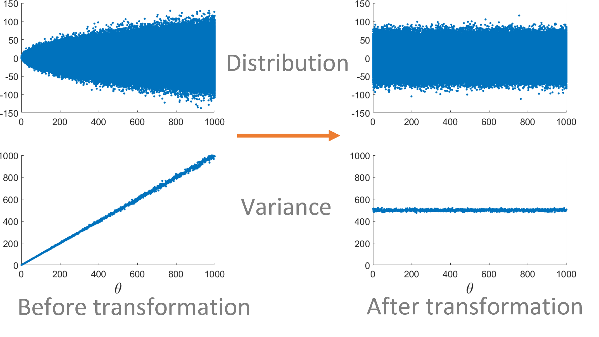
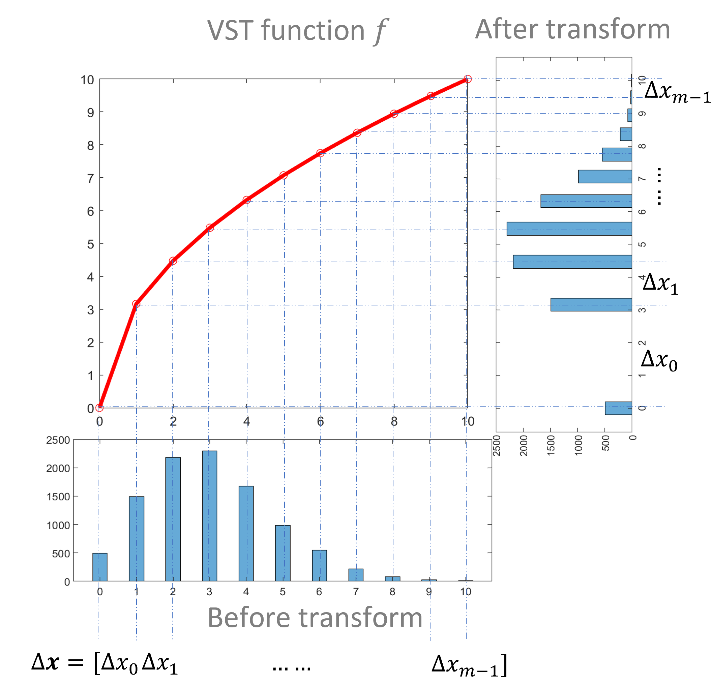
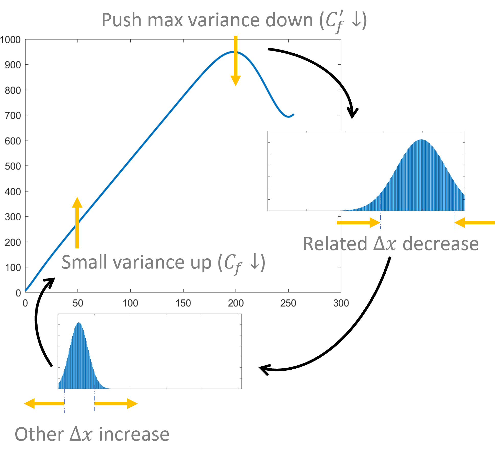
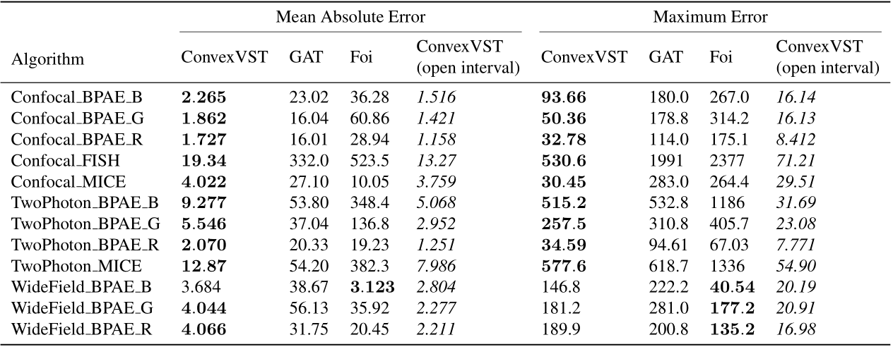
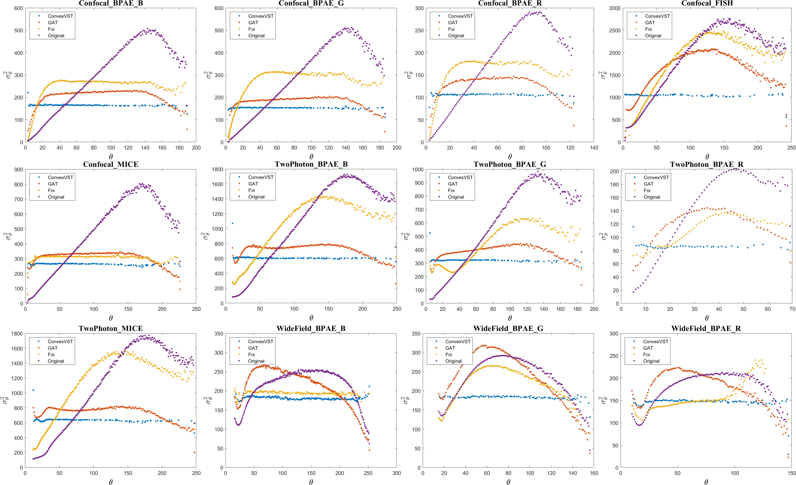
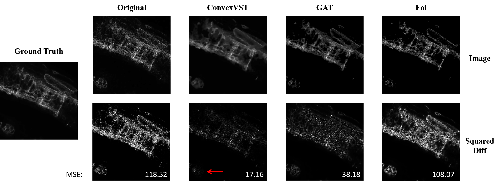

# Welcome to ConvexVST
ConvexVST (A **Convex** Optimization Approach to **V**ariance-**S**tabilizing **T**ransformation) is an approach to solve the variance-stabilizing transformation (VST) problem, transforming heteroscedastic data to homoscedastic data so that they are more tractable for subsequent analysis. ConvexVST can cast the VST problem into a convex optimization problem, which can always be efficiently solved, identified the specific structure of the convex problem, which further improved the efficiency of the proposed algorithm, and showed that any finite discrete distributions and the discretized version of any continuous distributions from real data can be variance-stabilized in an easy and nonparametric way. 

If you have any feedback or issue, you are welcome to either post them or send email to yug@vt.edu or mengfanw@vt.edu (Guoqiang Yu and Mengfan Wang at Virginia Tech).

## Quick Start
ConvexVST support **Matlab** only currently (Old versions before R2018b are not tested). The repertory contains:

* demo.m --------------- A simple version of ConvexVST. The code is short and easy to understand, but the function is also limited.
* ConvexVST.m --------- A formal version of ConvexVST. It support more functions, such as changeable weights. It also support Mosek solver acceleration (9.0 or later). Mosek is a commercial optimization solver but free for academic use. View [https://www.mosek.com/](https://www.mosek.com/) for more information.
* pdf.mat --------------- A family of Poisson-Gaussian distributions for demo.
* HistogramCount.m An algorithm using truncated Gaussian fitting to estimate noise distributions from 3D/4D image data. It's not a part of ConvexVST but may be helpful to large-volume image data stabilization. See [http://proceedings.mlr.press/v139/wang21p.html](http://proceedings.mlr.press/v139/wang21p.html) Supplementary Section 6 for more details.
* experiment ----------- The code of experiments in the paper.


## Algorithm Demonstration
### Variance-Stabilizing Transformation
#### Definition
VST problem is to transform heteroscedastic distributions to homoscedastic. That is, we want to find a transform function 𝑓 so that ]) is constant.
#### Application
* Keep the family of noise distributions invariant to the signal.
* Make data more tractable for subsequent analysis. 
##### Peer Method Limitation
* Simple parametric transformation functions cannot match well with the real data.
* More complicated models are hard to be analytically solved. 
<p align="center">
  
</p>

### Transformation Function
* 𝑓 is a valid transformation function if it is a monotonic increasing bijection.

* 𝑓 operates on the random variable . After transform, the distribution changes, and then the variance also changes.

* For discrete random variables, to change the distribution is equivalent to change the distance between adjacent bins. There is a one-to-one correspondence between 𝑓 and Δ𝒙.

* Therefore, the original problem, finding an analytical function, can be converted to find the appropriate distance between bins.
<p align="center">
  
</p>

### Problem Reformulation
* The usual objective function of VST problem is highly non-convex and hard to be optimized.

* As a substitution, we turn to minimize the maximum variance of all random variables.

#### Intuition   
* ①Variances are positively-correlated to the Δ𝒙. To minimize the max variance, related Δ𝑥 must decrease.
* ②The sum of Δ𝑥 should be constant (otherwise distributions are rescaled), so that other Δ𝑥  must increase to keep the balance.
* ③As a result, small variances up and max variances down, they are more closed to each other, and the total cost 𝐶_𝑓 also decreases.
<p align="center">
  
</p>

## Performance Comparison
#### Stabilization Performance 
* We compared our approach to two different peer methods on both synthetic and real data.
* The following table shows quantitative results based on two metrics on the public Fluorescence Microscopy Denoising (FMD) dataset, and the figure shows the corresponding stabilized variance curves.
<p align="center">
  
</p>
<p align="center">
  
</p>

#### Denoising performance
* A typical application of VST is denoising, where VST can keep the noise at the same level so that the denoising algorithm can simply assume the noise follows the Gaussian distribution.

* The original images are stabilized by different VST methods, and then denoised by BM3D algorithm.

* In the figure, the first row shows the original and denoised images while the second row shows the squared differences. 

* Corresponding MSEs are shown at the bottom. ConvexVST decreased MSE from 118.52 to 17.16, which is the best of peer methods.

* The bottom corner indicated by the red arrow is an example to show that our method results in a much smaller difference in this region than other methods.
<p align="center">
  
</p>

# Cite
## Please cite our paper if you find the code useful for your research.
Mengfan Wang, Boyu Lyu, Guoqiang Yu, [ConvexVST: A Convex Optimization Approach to Variance-stabilizing Transformation](http://proceedings.mlr.press/v139/wang21p.html), ICML 2021
```
@inproceedings{wang2021convexvst,
  title={ConvexVST: A Convex Optimization Approach to Variance-stabilizing Transformation},
  author={Wang, Mengfan and Lyu, Boyu and Yu, Guoqiang},
  booktitle={International Conference on Machine Learning},
  pages={10839--10848},
  year={2021},
  organization={PMLR}
}

```


